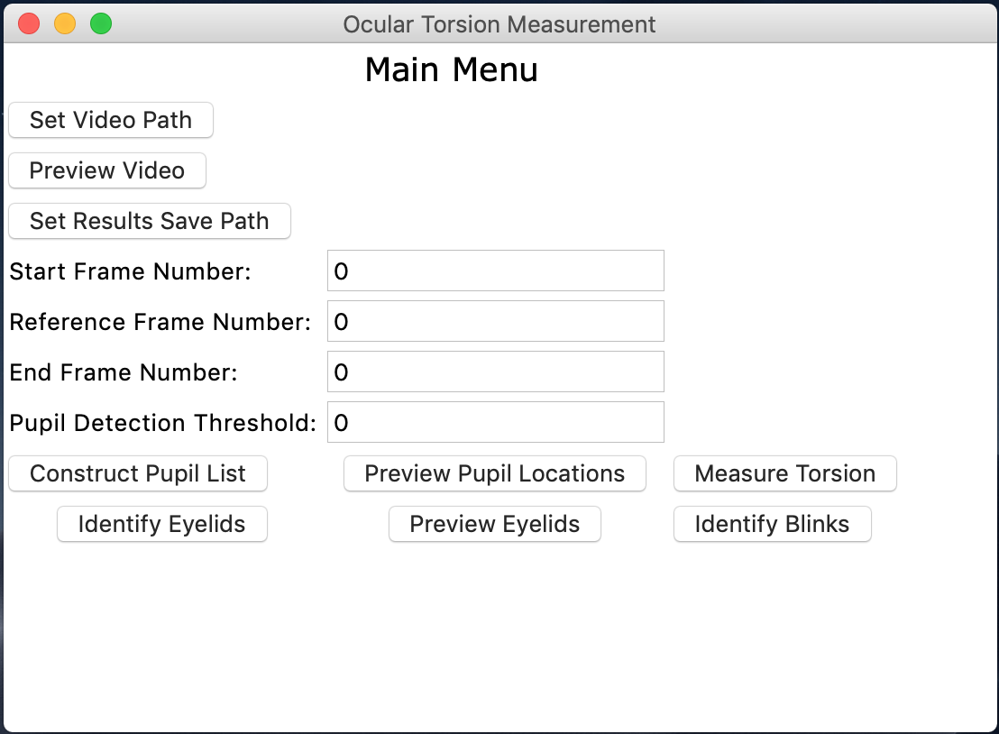
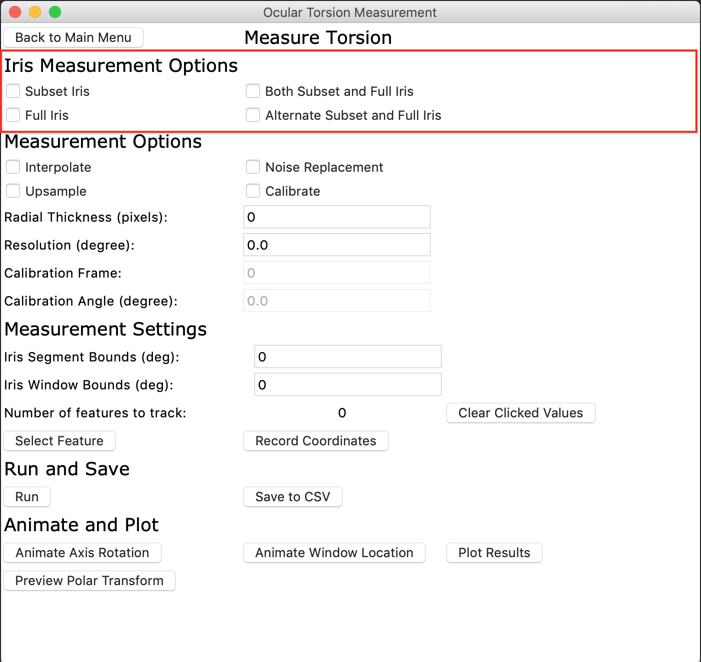
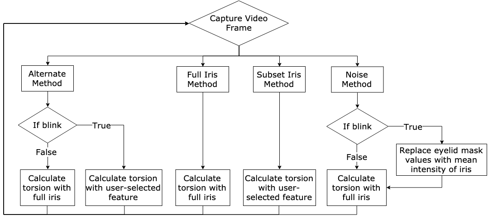
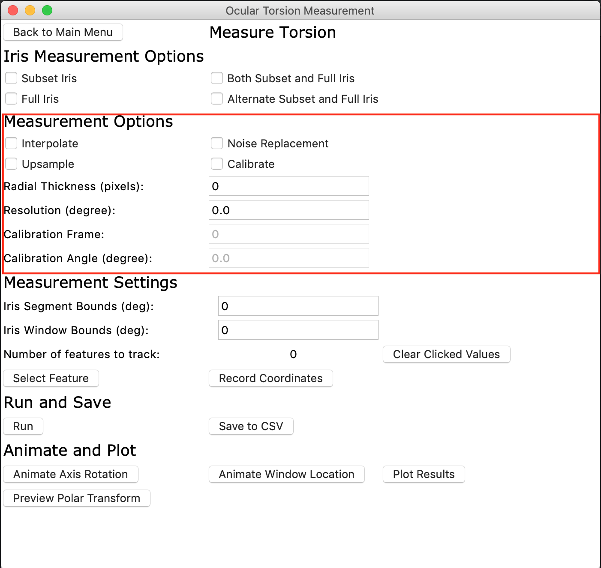
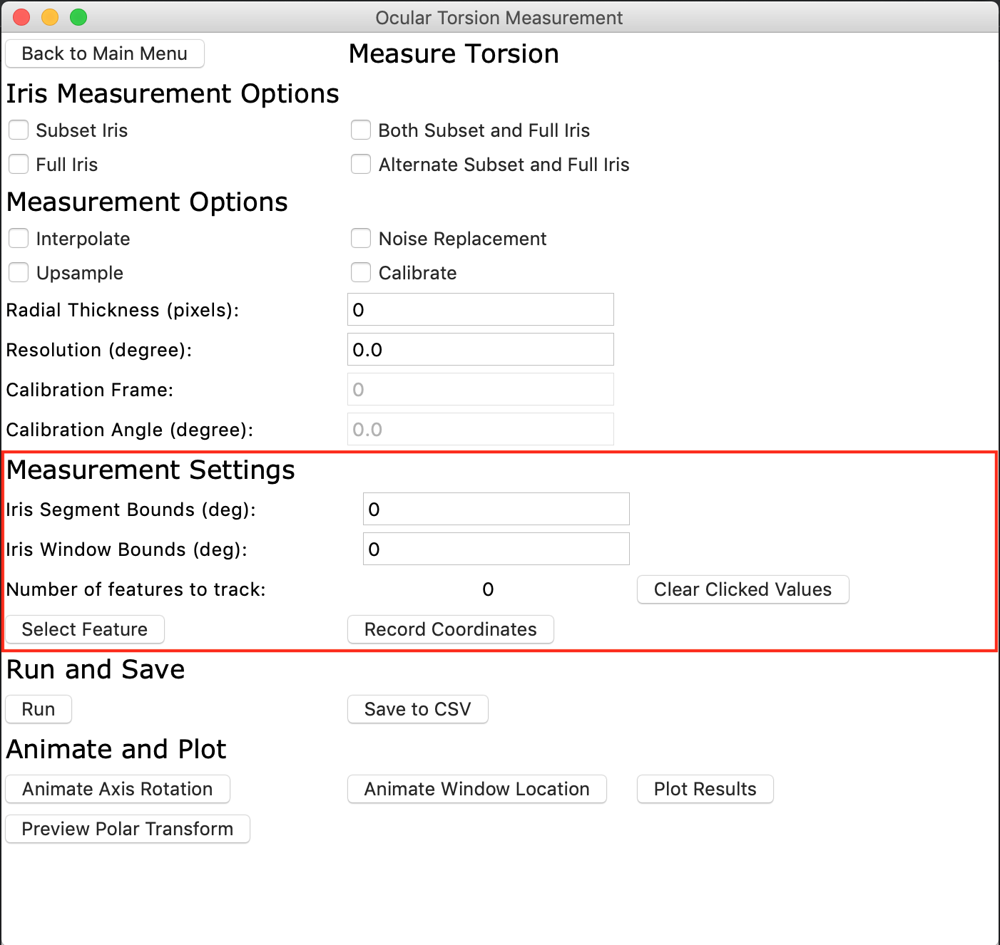

# Ocular Torsion Quantification
Python software package to quantify ocular torsion from video recordings.
Copied over from  https://github.com/enph1759/ota

## Quick Start Guide
### Requirements
- pip
- Python3
### Installing
Ocular Torsion Quantifier (OTA) is available on [this repo](https://github.com/ENPH459-1907/Ocular-Torsion-Quantification)
To download a version, open terminal (or git bash) and type 

```
git clone https://github.com/ENPH459-1907/Ocular-Torsion-Quantification.git
```

Or, click the green "clone or download" button on the repo page.
Dependencies can be installed by running 

```
pip install -r requirements.txt
```

### Running 
Enter into the directory of the project. To start the project, run ``` python run.py``` in the terminal. A GUI Window will be displayed.
To terminate the project, either close the terminal window or close the window of the GUI.

## Tutorial
### Step 1: Start the GUI
Enter into the directory of your project. Launch it with ``` python run.py```. A GUI Window will be displayed. To terminate the project, either close the terminal window or close the window of the GUI.
### Step 2: Setup video 

After opening the GUI, the user can select a video with the "Set Video Path" button. The "Preview Video" button can provide the user with a quick view of the video by showing every 50th frame of the video. The user can also set the desired directory to save following data with the "Set Results Save Path" button. If no directory has been selected, the results save path will be the project directory.

Next, the user can select a start and stop frame for the analysis to start and end at. This is useful if the first or last few frames of the video have calibrations. The user can also input a reference frame number for the torsion angle difference calculations to be referenced. 

Very importantly, a pupil detection threshold must be inputed. This value is dependent on the eye colour, camera, etc. In the example videos, the brown eyes need a pupil detection threshold of at least 30. A desirable pupil detection threshold is one where the contour around the pupil is optimized to encapsulate the entire pupil. 

### Step 3: Main Menu Pipeline

After the video has been setup, the buttons on the main menu must be selected in the following order:

1.  Construct Pupil List: Calculates the pupil center, radius, and creates a contour around the pupil
    -   Frames with the pupil center and pupil contour superimposed can be viewed with the "Preview Pupil Locations" button
2.  Identify Eyelids: Filters out the eyelids and eyelashes while identifying whether or not a frame captures a blink
    -   Frames with the eyelid mask superimposed can be viewed with the "Preview Eyelids" button.
    -   Frame numbers of frames that capture blinks can be listed on the console with the button "Identify Blinks"
3.  Measure Torsion: Takes user to next GUI menu with torsion calculation options.

### Step 4: Iris Measurement Options

There are 4 possible iris measurement options:

Each checkbox can be selected individually. Selectly "Both Subset and Full Iris" should be chosen if the user wants results for both full and subset iris calculations. The block diagram for each option is:



###Step 5: Measurement Options

There are 4 checkbox options available. More than one selections are allowed, besides "Interpolate" and "Upsample" which can't be selected simultaneously.



Values are needed for the "Radial Thickness" and "Resolution" fields. The radial thickness is the thickness of the iris to be used in the torsion calculations. The finest resolution for torsion calculation is 0.5 degrees. The sample videos included use a radial thickness of 70 pixels and a resolution of 0.5 degrees. 

If the "Calibrate" checkbox is selected, input for calibration frame and calibration angle is required.

### Step 6: Measurement Settings

This step is only required if the subset or alternative method is chosen. This step allows users to select the desired features for tracking. 



After recording the sizes (Iris Segment Bounds, Iris Window Bounds), the user need to "Select Feature", then "Record Coordinates" to have the system add the feature to the list of items to track.

### Step 7: Run and Save

Press the "Run" button to start the torsion calculations. The "Save to CSV" allows for the option of saving the data to the previously set file path.

### Step 8: Animate and Plot

The "Plot Results" button plots the torsion calculations with plotly. The user can also preview the polar transforms with "Preview Polar Transform".

## Development

### Branches

__IMPORTANT__: please do not work out of the develop and master branch unless you know what you're doing. Create your own branch and then merge into master.

__master__ This is the main branch of the repo, code owners must accept changes to this branch. Anyone who uses the app for data analysis will use the version on the master branch.

__develop__ This branch is the where the "next release" of the code lives. By this we mean all experimental or new changes will go here. Once all the changes are verified as working, this branch will be merged into master.

__gh-pages__: this branch is for the documentation, basically don't touch it unless you updating the documentation.

### Creating Your Own Branch

Create your own branch if you want to work on new features or play around.

On the __develop__ branch, type *git checkout -B <your_branch_name>*. Keep branches to small features and keep names descriptive. ex. *hotfix/xcorr2d*.